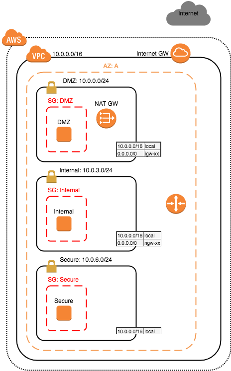

# AWS-demo

Simple AWS demo to set up the following components in an AWS Region:
* VPC 
* Internet Gateway
* Three Subnets
* NAT Gateway
* Route Tables
* Security Groups
* EC2 instance in each subnet
* SSH-config to connet to EC2 instances



## Shell

### Prerequisites

[Install aws-cli:](https://docs.aws.amazon.com/cli/latest/userguide/cli-install-macos.html)

Configure aws-cli:

```
aws configure set aws_access_key_id <key-id>
aws configure set aws_secret_access_key <key>
aws configure set region <region>
```

Credentials and config is usually found here: `~/.aws/config` and `~/.aws/credentials`

### Run
Run the script:
```
./aws-demo.sh
```

## Ansible

### Prerequisites
Install Ansible and some Python dependencies

* Ansible 2.4+
```
sudo pip install ansible
sudo pip install boto3 --ignore-installed six
sudo pip install botocore --ignore-installed six
```

### Run
Export AWS access key:
```
export AWS_ACCESS_KEY_ID=<key-id>
export AWS_SECRET_ACCESS_KEY=<key>
```
Run Ansible playbook:
```
ansible-playbook -i inventory playbooks/playbook.yml -e @vars.yml
```